# Jadezo CSS

Developed by Zarmeen, Jesse, & Daniela

## Description

Jadezo CSS is a CSS framework that can be used to provide a simple and modern look to your website. Please consult the Installation, Usage, and Customization sections for more information.

## Installation

To use Jadezo CSS in your project, follow these steps:

1. **Create a Directory:** At your website's root level, create a directory titled `css`. Within this folder, create a `main.css` file.

2. **Link the CSS File:** In your `index.html` file, link to the `main.css` file to include Jadezo CSS in your project.

3. **Compile SASS:** Use the following command: sass --watch ./src/main.scss ./css/main.css

## Usage

With Jadezo CSS, you can easily customize the appearance of text on your website by adding specific classes to your HTML tags. Replace `[brackets]` with your desired attribute:

- **Font Weight:** `type-weight-[weight]`
- **Font Italic:** `type-[italic]`
- **Line Height Utilities:** `type-line-[tight, normal, loose]`
- **Letter Spacing:** `type-spacing-[tight, normal, wide]`
- **Text Transform:** `type-[uppercase, lowercase, capitalize]`
- **Text Alignment:** `type-align-[left, center, right, justify]`

### Text Colors

Apply color to your text using these utility classes:

- **Primary:** `.text-primary` - Use for primary text.
- **Secondary:** `.text-secondary` - Use for secondary text.
- **Success:** `.text-success` - Use for success messages.
- **Info:** `.text-info` - Use for informational messages.
- **Warning:** `.text-warning` - Use for warnings.
- **Error:** `.text-error` - Use for errors.
- **Light:** `.text-light` - Use for light text on dark backgrounds.
- **Dark:** `.text-dark` - Use for dark text on light backgrounds.

### Background Colors

To set background colors, use the following classes:

- **Primary:** `.bg-primary`
- **Secondary:** `.bg-secondary`
- **Success:** `.bg-success`
- **Info:** `.bg-info`
- **Warning:** `.bg-warning`
- **Error:** `.bg-error`
- **Light:** `.bg-light`
- **Dark:** `.bg-dark`

### Font Weight and Sizes

For font weight:
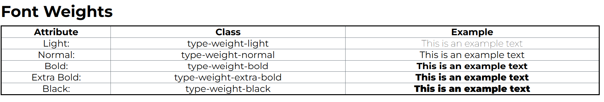

- **Normal:** `.font-normal`
- **Bold:** `.font-bold`

For font sizes:
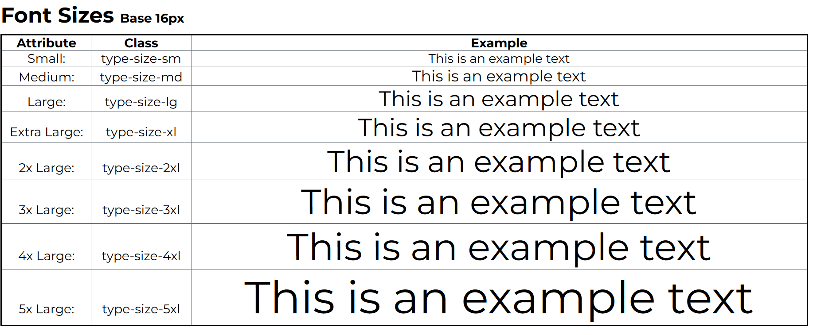

- **Large (lg):** `.font-lg`
- **Small (sm):** `.font-sm`
- **Extra Small (xs):** `.font-xs`
- **Extra Large (xl):** `.font-size-xl`
- **2x Extra Large (2xl):** `.font-size-2xl`

### Strong and Emphasis Styles

Emphasize text using `.strong` for bold and `.emphasis` for italic text. These classes make it easy to highlight parts of your text.

## Navigation

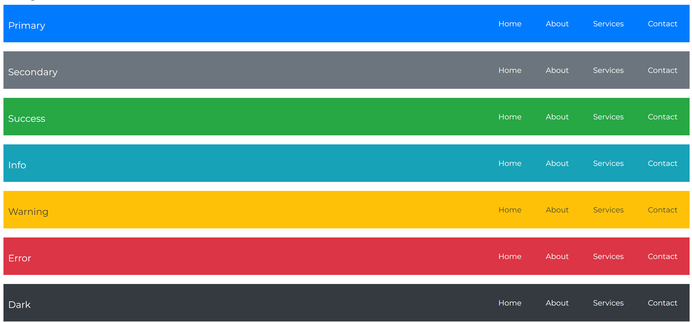

### Buttons

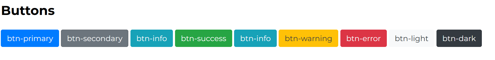

Create interactive and visually appealing buttons by applying these classes:

- **Primary Button:** `btn-primary` - Use for main actions.
- **Secondary Button:** `btn-secondary` - Use for alternative actions.
- **Success Button:** `btn-success` - Use for successful actions.
- **Info Button:** `btn-info` - Use for informational buttons.
- **Warning Button:** `btn-warning` - Use for warnings or cautionary actions.
- **Error Button:** `btn-error` - Use for error-related actions.
- **Light Button:** `btn-light` - Use for light-themed buttons.
- **Dark Button:** `btn-dark` - Use for dark-themed buttons.

### Blockquotes

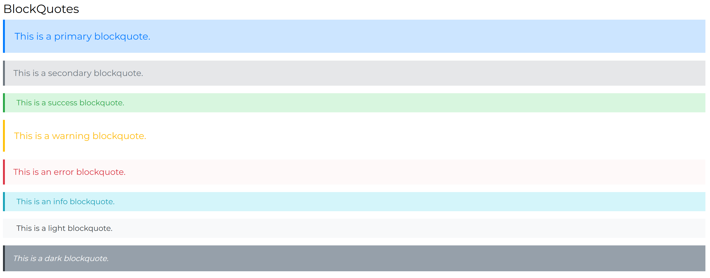

Enhance the presentation of quotes or highlighted text with these styles:

- **Primary Blockquote:** `.blockquote-primary` - Use for important quotes.
- **Secondary Blockquote:** `.blockquote-secondary` - For secondary emphasis.
- **Success Blockquote:** `.blockquote-success` - Highlights success or positive quotes.
- **Warning Blockquote:** `.blockquote-warning` - Use for cautionary or warning quotes.
- **Error Blockquote:** `.blockquote-error` - For error or critical messages.
- **Info Blockquote:** `.blockquote-info` - For informational content.
- **Light Blockquote:** `.blockquote-light` - Light-themed for dark backgrounds.
- **Dark Blockquote:** `.blockquote-dark` - Dark-themed for contrast on light backgrounds.

### Unordered List

Default: (no class to be specified)

Style A: `.ul-style-a`

Style B: `.ul-style-b`

### Ordered List

Default: (no class to be specified)

Style A: `.ol-style-a`

Style B: `.ol-style-b`

### Descriptive List

Default: (no class to be specified)

Style A: `.dl-style-a`

Style B: `.dl-style-b`

### Tables

Default: (no class to be specified)

Style A: `.table-style-a`

Style B: `.table-style-b`

## Customization
## Forms
- **Default Form:** All its inner elements are set to be displayed in a column. Additionally, all inputs and text area boxes have a light background color for easier differentiation.
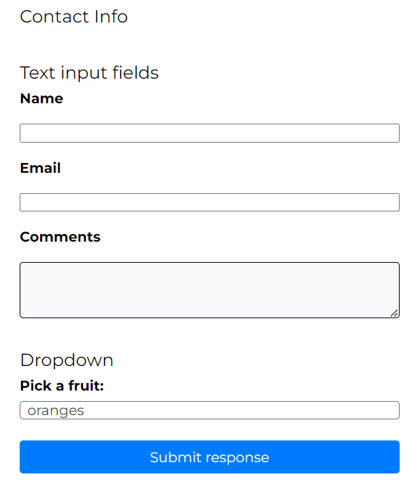 

- **Form Style A:** `.form-style-a` - This form was created for light themed apps. 
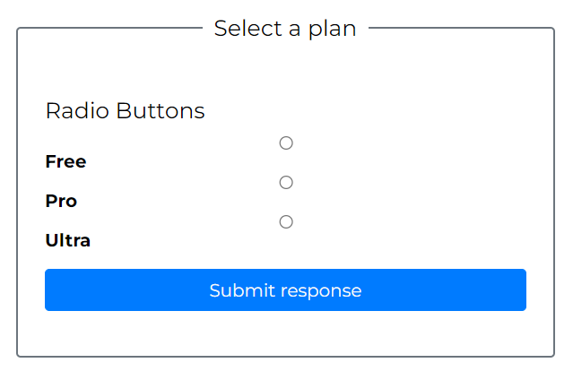 

- **Form Style B:** `.form-style-b` - This form was created for dark themed apps.
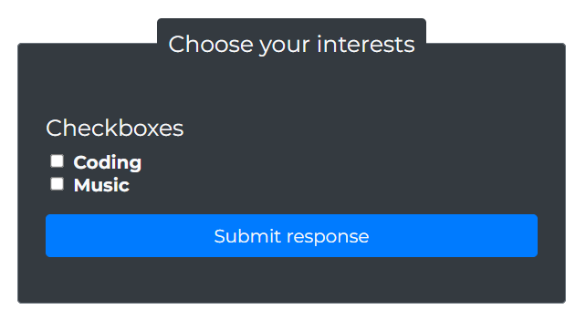 

# Customization

## Layouts 
The following CSS variables have been pre-created for uniform styling of elements.
*Customize or override variables from the _variables.scss file.*

### Borders
- **No border** `$no-border` Removes border from an element setting it to none.

- **Rounded borders:** `$rounded-border` - Adds a border radius of 0.25rem.
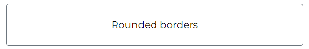 

- **Thin border line** `$thin-border` - Creates a thin border line.
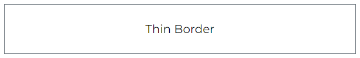 

- **Thick border line** `$thick-border` - Creates a thicker border line.
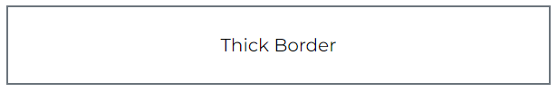 

*Note that borders are created using the secondary color*

### Paddings & margins
- **Basic margin** `$section-margin-normal` - Applies a margin on top and bottom of elements without affecting the side margin.
- **Large margin** `$section-margin-large` - Applies a larger margin on top and bottom of elements without affecting the side margin.
- **Basic padding** `$base-padding` - Applies a basic padding on all sides.
- **Large Padding** `$large-padding` - Applies a larger padding on all sides. 
- **Table content padding** `$table-content-padding` - Utilized to apply padding to the inner table content cells. The padding ratio is set to 0.5rem for the top and bottom and 1rem for the left and right.