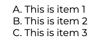

# Jadezo CSS
Developed by - Zarmeen, Jesse, & Daniela 

## Description 

Jadezo CSS is a CSS framework that can be used to provide a simple and modern look to your website. Please consult the Installation, Usage, and Customization sections for more information.

## Installation 
(...)

## Usage

### Unordered List 
---
Default: (no class to be specified)

 

Style A: `.ul-style-a`

 

Style B: `.ul-style-b`

 

### Ordered List 
---
Default: (no class to be specified) 

 

Style A: `.ol-style-a`

Style B: `.ol-style-b`

### Descriptive List 
---
Default: (no class to be specified)

Style A: `.dl-style-a`

Style B: `.dl-style-b`

### Tables 
---

Default: (no class to be specified)

Style A: `.table-style-a`

Style B: `.table-style-b`

## Customization
(...)